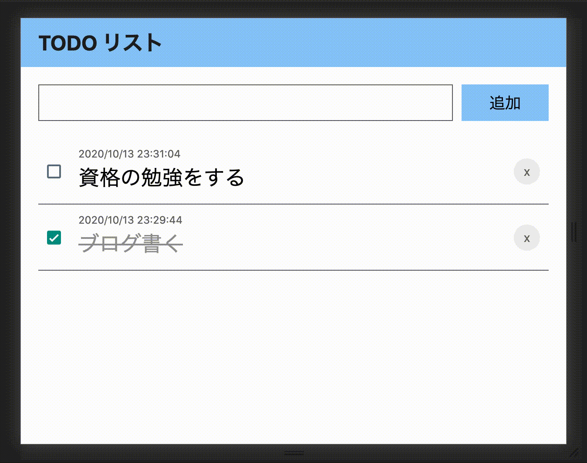

# rnw-todo

React Native for Web と Recoil で簡単な TODO リストを作ってみた。一応、更新・削除ができて、LocalStorage に保存されます。

## Demo



## Environment

```
$ sw_vers
sw_vers
ProductName:	Mac OS X
ProductVersion:	10.15.7
BuildVersion:	19H2

$ node --version
v14.7.0

$ yarn --version
1.22.10

$ yarn list --depth=0
...
react@16.13.1
recoil@0.0.13
typescript@3.7.5
...
```

## Usage

```
$ yarn install
$ yarn start
```
